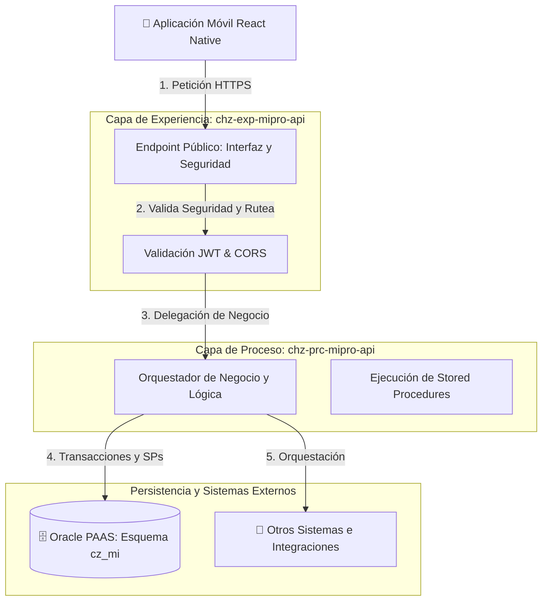
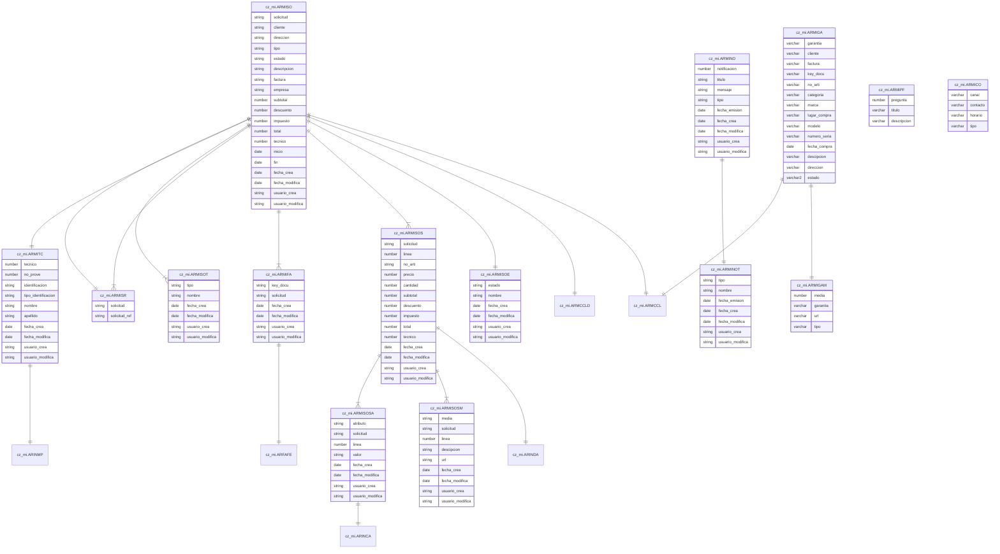

# Spec Driven Document: Módulo de Registro de Garantías (MIPRO)

## 1. Resumen Ejecutivo
Este documento define la arquitectura, flujos técnicos, especificación de interfaz pixel-perfect e integración de datos para el desarrollo del **Módulo de Registro de Garantías**. El requerimiento principal indica un pivote en la aplicación móvil actual (React Native) para aislar temporalmente módulos previos y centrar la experiencia únicamente en: **Login ➔ Registro (clientes nuevos) ➔ Registro de Ticket de Garantía**.

La interfaz del módulo móvil se implementará respetando estrictamente los tokens de diseño, etiquetas, colores e interacciones provistos por el equipo de UX/UI. Las APIs no utilizarán versionamiento en sus rutas y la comunicación de datos se gestionará bajo un estándar de respuesta HTTP 200 obligatorio.

A nivel de reglas de negocio:
* **Todos los campos de registro de garantía son estrictamente opcionales, a excepción de: Categoría (`categoria`), Lugar de Compra (`lugar_compra`), Descripción del Fallo (`descipcion`) y Dirección (`direccion`)**, los cuales son campos obligatorios requeridos para la inserción.
* **Estándar de Catálogos (Longitud de Códigos):** Para todos los catálogos lógicos del sistema (tanto de control de estados como maestros de configuración), **el código que actúa como clave primaria o valor de persistencia tiene una longitud estricta de 1 carácter** (tipo **`VARCHAR2(1)`** en la base de datos Oracle PAAS y representaciones de un solo carácter en JSON/SQLite). Esto aplica obligatoriamente para:
  - Categorías (`categoria`)
  - Marcas (`marca`) 
  - Lugares de Compra (`lugar_compra`)
  - Estados (`estado`)

---

## 2. Arquitectura de Backend (API-Led Connectivity)

El backend de MIPRO está diseñado bajo el patrón arquitectónico de **API-Led Connectivity**, estructurando los flujos de información en dos capas de microservicios claramente delimitadas. Esto garantiza el desacoplamiento físico, la seguridad perimetral y la abstracción completa de la base de datos empresarial frente al cliente móvil.



### 2.1. Capa de Experiencia: `chz-exp-mipro-api`
* **Rol Principal:** Es la puerta de enlace pública y la interfaz de cara a los clientes externos.
* **Responsabilidades:**
  - Control de seguridad y autenticación perimetral (validación y emisión de tokens JWT, políticas CORS, rate limiting).
  - Sanitización y validación inicial de los payloads de entrada de las peticiones móviles.
  - Abstracción absoluta: **No almacena lógica de negocio pesada, ni interactúa directamente con bases de datos relacionales ni sistemas legados**. No expone credenciales ni estructuras de tablas físicas.
  - Rutea y delega las solicitudes de forma segura hacia la capa de procesos interna.

### 2.2. Capa de Procesos: `chz-prc-mipro-api`
* **Rol Principal:** Es el núcleo transaccional y el orquestador de reglas de negocio.
* **Responsabilidades:**
  - Gobierna e implementa de forma centralizada toda la lógica de negocio y flujos de trabajo de MIPRO.
  - Posee la **conexión directa y exclusiva a la base de datos Oracle empresarial (`PAAS`)**, operando bajo el esquema **`cz_mi`** mediante Stored Procedures.
  - Integra y coordina la comunicación con otros microservicios, sistemas internos y plataformas de terceros (ej. notificaciones push, pasarelas, almacenamiento externo).

---

## 3. Tokens de Diseño y Guía Visual (UI/UX)

La aplicación móvil utilizará estrictamente las variables de diseño predefinidas en el codebase del proyecto local `constants/Colors.ts` y `constants/GlobalStyles.ts`.

### 3.1. Paleta de Colores (`constants/Colors.ts`)
Los estilos visuales utilizarán las siguientes constantes de color mapeadas para mantener la homogeneidad:
* **Color Primario:** `Colors.primary` (`#FFEE00` - Amarillo Brillante).
* **Color de Contraste / Texto Principal:** `Colors.black` (`#000000`).
* **Fondo de Contenido:** `Colors.white` (`#FFFFFF`).
* **Textos Secundarios:** `Colors.gray` (`#575756`).
* **Bordes / Separadores:** `Colors.border` (`#D0D0D0`).
* **Fondos de Pantalla:** `Colors.background` (`#F6F6F5`).

### 3.2. Estilos Globales (`constants/GlobalStyles.ts`)
Toda la estructuración visual de contenedores, formularios y cabeceras se importará desde `GlobalStyles.ts` (ej. `WelcomeStyles`, `LoginStyles`, `HomeStyles`) para preservar las dimensiones, márgenes y la fuente tipográfica corporativa `BebasNeue_400Regular` cargada al inicio del ciclo de vida de la aplicación.

---

## 4. Componentes Personalizados (Custom Components)

Para garantizar un código mantenible y libre de duplicidad, todas las pantallas del módulo de garantías utilizarán los componentes predefinidos localizados en `components/`:

1. **`CustomText` (`components/CustomText.tsx`):**
   - Utilizado para renderizar todos los textos de la interfaz. Soporta variantes tipográficas consistentes como `h1`, `h2`, `body`, y se integra nativamente con la librería de traducciones.
2. **`CustomButton` (`components/CustomButton.tsx`):**
   - Utilizado para todas las acciones de envío y progresión del wizard ("Continuar", "Enviar solicitud", "Volver al home"). Soporta variantes de diseño (`outline`, `primary`).
3. **`CustomInput` (`components/CustomInput.tsx`):**
   - Campo de entrada estándar de texto para formularios (`modelo`, `sku`, `numero_serie`, `factura`).
4. **`CustomTabToggle` (`components/CustomTabToggle.tsx`):**
   - Selector deslizante y conmutador visual utilizado en el Dashboard para el filtrado rápido de estados.

---

## 5. Manejo de Multi-Idioma (i18n)

La internacionalización de la aplicación móvil se implementa mediante `i18next`, `react-i18next` y `expo-localization` en `constants/i18n/`.

### 5.1. Estructura de Traducción y Nuevas Etiquetas
Para dar soporte al módulo de registro de garantías, se crea un nuevo archivo de etiquetas de traducción **`constants/i18n/garantia.labels.ts`** respetando el estilo de los catálogos de traducción existentes (como `login.labels.ts` o `home.labels.ts`):

```typescript
export const garantiaLabels = {
  garantia: {
    es: {
      tituloDashboard: "GESTIÓN DE GARANTÍA",
      btnGestionar: "Gestionar Garantía",
      stepProducto: "1 PRODUCTO",
      stepReporte: "2 REPORTE",
      stepDireccion: "3 DIRECCIÓN",
      tipoProducto: "TIPO DE PRODUCTO",
      compradoEn: "COMPRADO EN",
      marca: "MARCA",
      modelo: "MODELO",
      sku: "SKU",
      noSerie: "NÚMERO DE SERIE",
      noFactura: "NO. DE FACTURA",
      fechaCompra: "FECHA DE COMPRA",
      aliasEquipo: "NOMBRE DEL EQUIPO (ALIAS)",
      placeholderProducto: "Selecciona un producto...",
      placeholderLugar: "Selecciona un lugar...",
      placeholderMarca: "Selecciona una marca...",
      placeholderModelo: "Ej: Deluxe 2000",
      placeholderSku: "Ej: SKU-987654",
      placeholderSerie: "Ej: SN-123456789",
      placeholderFactura: "Ej: FAC-001-2024",
      placeholderFecha: "Selecciona una fecha",
      placeholderAlias: "Ej: Aire cuarto de Ana",
      preguntaFallo: "¿QUÉ PROBLEMA PRESENTA EL EQUIPO?",
      placeholderFallo: "Describe detalladamente el fallo o defecto...",
      adjuntarMedia: "ADJUNTAR FOTOS O VIDEOS (OPCIONAL)",
      misDirecciones: "MIS DIRECCIONES",
      ubicarMapa: "Ubicar en el mapa",
      soporteInfo: "Estos datos nos permiten ubicarte rápidamente para brindarte el mejor soporte técnico.",
      btnEnviar: "Enviar solicitud",
      exitoTitulo: "¡SOLICITUD ENVIADA!",
      exitoMensaje: "Hemos recibido tu reporte. El equipo técnico de MiPRO lo revisará y te contactará en un plazo de 24 a 48 horas.",
      btnVolver: "Volver al home"
    },
    en: {
      tituloDashboard: "WARRANTY MANAGEMENT",
      btnGestionar: "Manage Warranty",
      stepProducto: "1 PRODUCT",
      stepReporte: "2 REPORT",
      stepDireccion: "3 ADDRESS",
      tipoProducto: "PRODUCT TYPE",
      compradoEn: "PURCHASED AT",
      marca: "BRAND",
      modelo: "MODEL",
      sku: "SKU",
      noSerie: "SERIAL NUMBER",
      noFactura: "INVOICE NO.",
      fechaCompra: "PURCHASE DATE",
      aliasEquipo: "EQUIPMENT ALIAS",
      placeholderProducto: "Select a product...",
      placeholderLugar: "Select a location...",
      placeholderMarca: "Select a brand...",
      placeholderModelo: "E.g. Deluxe 2000",
      placeholderSku: "E.g. SKU-987654",
      placeholderSerie: "E.g. SN-123456789",
      placeholderFactura: "E.g. FAC-001-2024",
      placeholderFecha: "Select a date",
      placeholderAlias: "E.g. Bedroom AC",
      preguntaFallo: "WHAT PROBLEM IS THE EQUIPMENT HAVING?",
      placeholderFallo: "Describe the fault or defect in detail...",
      adjuntarMedia: "ATTACH PHOTOS OR VIDEOS (OPTIONAL)",
      misDirecciones: "MY ADDRESSES",
      ubicarMapa: "Locate on map",
      soporteInfo: "This data allows us to quickly locate you to provide the best technical support.",
      btnEnviar: "Submit request",
      exitoTitulo: "REQUEST SENT!",
      exitoMensaje: "We have received your report. The MiPRO technical team will review it and contact you within 24 to 48 hours.",
      btnVolver: "Go back home"
    }
  }
};
```

Este archivo se importa y expande dentro del consolidado de `allLabels` en `constants/i18n/index.ts` para que todas las traducciones de garantías estén expuestas de forma unificada mediante el Hook nativo `useTranslation('garantia')`.

---

## 6. Estructura de Navegación y Aislamiento en Expo Router (`app/`)

### 6.1. Jerarquía Física del Proyecto (`app-mipro`)
La aplicación mantiene toda la estructura de carpetas y pantallas preexistentes en la carpeta física `app/` para salvaguardar futuros desarrollos. **Bajo ninguna circunstancia se eliminará el código ni los directorios de los otros módulos** (tales como `agendar`, `servicios`, `proyectos`, `notificaciones`, etc.).

### 6.2. Estrategia de Aislamiento Visual del Flujo de Garantías
Para ocultar los módulos funcionales preexistentes en esta primera versión (la cual se enfoca estrictamente en Garantías), se configura la redirección condicional en la raíz de navegación:

1. **`app/index.tsx` (Welcome Screen):**
   - Evalúa si existe sesión activa (`hasToken`). Si es falso, muestra las pantallas públicas de inicio de sesión (`login`) o creación de cuenta (`signup`). Si es verdadero, fuerza la redirección inmediata a `home` (Dashboard de Garantías).
2. **Ocultamiento en el Menú y Navegación:**
   - La pantalla principal de aterrizaje post-login será **`app/home/index.tsx`** (la cual actuará como el Dashboard de Garantías).
   - Se inhabilitan de manera temporal los botones, accesos directos, cajones (Drawer) o pestañas (Tab Bar) que conectan con los módulos de `agendar`, `servicios`, `proyectos`, etc. 
   - El código fuente de estas carpetas permanece totalmente intacto en el disco, garantizando que el desarrollador pueda habilitar los módulos progresivamente en versiones futuras simplemente restaurando sus respectivos enlaces de navegación en `app/home` y `app/_layout.tsx`.

---

## 7. Estándar de Comunicación y Respuestas de API (HTTP 200 Obligatorio)

Para asegurar la tolerancia a fallos y la uniformidad en las integraciones móviles, **todos los endpoints de las APIs de MIPRO deben retornar estrictamente el código de estado HTTP 200 OK**. Bajo ninguna circunstancia se retornará un código 500, 400 u otro código de error HTTP a nivel de protocolo de transporte.

La validación lógica del resultado se maneja en el cuerpo del JSON (Payload) bajo el objeto estandarizado **`resultado`** con el siguiente formato:

### 7.1. Estructura de Respuesta Exitosa (`codigo: 0`)
Cuando la operación o integración finaliza exitosamente, el payload de respuesta contendrá los datos del negocio y el objeto `resultado` con `codigo: 0`:
```json
{
  "resultado": {
    "codigo": 0,
    "mensaje": "",
    "warning": ""
  },
  "datos": {
    "ejemplo_campo": "valor"
  }
}
```

### 7.2. Estructura de Respuesta de Fallo (`codigo > 0`)
Si ocurre un error lógico, una excepción en base de datos o fallos de validación, se retornará igualmente un HTTP 200, pero el `codigo` dentro del objeto `resultado` será mayor a cero (habitualmente `1`), y el campo `mensaje` contendrá el detalle del error:
```json
{
  "resultado": {
    "codigo": 1,
    "mensaje": "Mensaje detallado del error o validación fallida.",
    "warning": ""
  }
}
```

---

## 8. Especificación de Endpoints y Payloads (Interfaz en Capa de Experiencia)

*Nota: La aplicación móvil interactúa únicamente con estos endpoints expuestos por la capa de experiencia `chz-exp-mipro-api`, la cual valida la seguridad y delega las operaciones hacia `chz-prc-mipro-api` para la ejecución en base de datos.*

### 8.1. `POST /login`
Autenticación de usuarios.
- **Request Body:**
  ```json
  {
    "correo": "maria@mipro.com",
    "password": "hashed_password"
  }
  ```
- **Response Payload (Éxito):**
  ```json
  {
    "resultado": {
      "codigo": 0,
      "mensaje": "",
      "warning": ""
    },
    "token": "JWT_TOKEN",
    "user": {
      "id": "USR-10293",
      "nombre": "María"
    },
    "last_updated_catalogues": "2026-05-18T10:00:00Z"
  }
  ```

### 8.2. `GET /catalogos`
Sincronización unificada de catálogos para SQLite. Mapea códigos estrictos de longitud 1.
- **Response Payload (Éxito):**
  ```json
  {
    "resultado": {
      "codigo": 0,
      "mensaje": "",
      "warning": ""
    },
    "last_updated": "2026-05-18T10:00:00Z",
    "productos": [
      { "categoria": "1", "nombre": "Aire Acondicionado Sala" },
      { "categoria": "2", "nombre": "Televisor Smart" }
    ],
    "marcas": [
      { "marca": "P", "nombre": "Panasonic" },
      { "marca": "L", "nombre": "LG" }
    ],
    "lugares_compra": [
      { "lugar_compra": "E", "nombre": "Costa del Este" },
      { "lugar_compra": "C", "nombre": "Calle 50" }
    ]
  }
  ```

### 8.3. `POST /garantias`
Registra la cabecera del reclamo de garantía.
*Nota: Los códigos de catálogo (`categoria`, `marca`, `lugar_compra`, `estado`) se envían obligatoriamente como caracteres de longitud 1.*
- **Request Body:**
  ```json
  {
    "cliente": "CLI-10293",
    "categoria": "1",
    "lugar_compra": "E",
    "descipcion": "El aire acondicionado no enfría y hace ruido.",
    "direccion": "DIR-008",
    "factura": null,
    "key_docu": null,
    "no_arti": null,
    "marca": "P",
    "modelo": null,
    "numero_seria": null,
    "fecha_compra": null,
    "estado": "A"
  }
  ```
- **Response Payload (Éxito):**
  ```json
  {
    "resultado": {
      "codigo": 0,
      "mensaje": "",
      "warning": ""
    },
    "garantia": "GAR-2024-0892"
  }
  ```

### 8.4. `POST /media`
Sube archivos multimedia asociados a la garantía (`cz_mi.armigam`).
- **Request Body (Multipart / FormData):**
  ```json
  {
    "garantia": "GAR-2024-0892",
    "tipo": "image/jpeg",
    "file": "<file_binary>"
  }
  ```
- **Response Payload (Éxito):**
  ```json
  {
    "resultado": {
      "codigo": 0,
      "mensaje": "",
      "warning": ""
    },
    "media": 452901,
    "url": "https://storage.mipro.com/garantias/GAR-2024-0892_img1.jpg"
  }
  ```

### 8.5. `POST /direcciones`
Registra una nueva dirección para el cliente en el sistema.
- **Request Body:**
  ```json
  {
    "cliente": "CLI-10293",
    "direccion": "Vía principal, Edificio Colinas",
    "latitud": 8.9830,
    "longitud": -79.5190
  }
  ```
- **Response Payload (Éxito):**
  ```json
  {
    "resultado": {
      "codigo": 0,
      "mensaje": "",
      "warning": ""
    },
    "direccion": "DIR-015"
  }
  ```

### 8.6. `GET /garantias`
Consulta del listado de garantías.
- **Query Params:**
  - `tipo`: Permite filtrar el alcance de la búsqueda.
    - Valor `"activas"`: Retorna únicamente los casos con estado activo.
    - Valor `"historial"`: Retorna todos los registros de garantías del usuario.
- **Response Payload (Éxito):**
  ```json
  {
    "resultado": {
      "codigo": 0,
      "mensaje": "",
      "warning": ""
    },
    "garantias": [
      {
        "garantia": "GAR-2024-0892",
        "fecha_compra": "2026-05-10",
        "no_arti": "SKU-987654",
        "marca": "P",
        "modelo": "Deluxe 2000",
        "estado": "A"
      }
    ]
  }
  ```

---

## 9. Base de Datos Única SQLite Local y Sincronización Offline (`mipro.db`)

Para simplificar el mantenimiento, garantizar la integridad relacional y seguir el patrón corporativo de **Oracle (PAAS)**, la aplicación móvil operará con **una única base de datos SQLite consolidada** llamada **`mipro.db`** (utilizando la librería `expo-sqlite`). 

### 9.1. Reglas de Diseño Relacional Local (Patrón `armisoe` y `armisot`)
Para garantizar la consistencia relacional y evitar discrepancias entre el cliente móvil y el backend, las tablas internas en `mipro.db` se diseñan bajo las siguientes reglas estrictas:
1. **Sin Prefijos Redundantes:** No se utilizarán nombres con prefijo `sqlite_`. Las tablas adoptan nombres directos, limpios y descriptivos alineados al esquema corporativo.
2. **Sin Columnas Genéricas `id`:** Las tablas locales evitan el uso de columnas comodín `id`. Siguiendo el estándar de las tablas del backend `armisoe` (cuyo identificador principal es la columna `estado`) y `armisot` (cuyo identificador principal es `tipo`), las tablas locales definen su columna de Clave Primaria mapeando exactamente el **nombre lógico de la entidad**.
3. **Códigos de Catálogo de 1 Carácter:** De acuerdo a la regla corporativa de MIPRO, todas las claves de catálogos locales persistidas en SQLite poseen un tipo de dato y valor de longitud estricta de 1 carácter.
4. **Esquema Unificado de Tablas:**

```sql
-- 1. Tabla de Categorías de Producto (Estilo armisot - PK: categoria (longitud 1))
CREATE TABLE IF NOT EXISTS armigac (
  categoria   TEXT PRIMARY KEY CHECK(length(categoria) = 1),
  nombre      TEXT NOT NULL
);

-- 2. Tabla de Marcas de Producto (Estilo armisot - PK: marca (longitud 1))
CREATE TABLE IF NOT EXISTS armigamr (
  marca       TEXT PRIMARY KEY CHECK(length(marca) = 1),
  nombre      TEXT NOT NULL
);

-- 3. Tabla de Lugares de Compra (Estilo armisot - PK: lugar_compra (longitud 1))
CREATE TABLE IF NOT EXISTS armigal (
  lugar_compra TEXT PRIMARY KEY CHECK(length(lugar_compra) = 1),
  nombre       TEXT NOT NULL
);

-- 4. Tabla Caché de Garantías Registradas (Esquema espejo de cz_mi.armiga - PK: garantia)
CREATE TABLE IF NOT EXISTS armiga (
  garantia      TEXT PRIMARY KEY,
  cliente       TEXT NOT NULL,
  factura       TEXT,
  key_docu      TEXT,
  no_arti       TEXT,
  categoria     TEXT NOT NULL CHECK(length(categoria) = 1),
  marca         TEXT CHECK(marca IS NULL OR length(marca) = 1),
  lugar_compra  TEXT NOT NULL CHECK(length(lugar_compra) = 1),
  modelo        TEXT,
  numero_seria  TEXT,
  fecha_compra  TEXT,
  descipcion    TEXT NOT NULL,
  direccion     TEXT NOT NULL,
  estado        TEXT NOT NULL CHECK(length(estado) = 1)
);
```

### 9.2. Flujo y Protocolo de Sincronización

La sincronización se realiza mediante una comparación inteligente de marcas de tiempo en lugar de consultas de API recurrentes:

1. **Al iniciar sesión (`POST /login`):**
   - El payload de login retorna el campo `last_updated_catalogues` (marca de tiempo ISO del servidor).
   - El app compara este valor con el guardado en su almacenamiento clave-valor persistente (`AsyncStorage`).
2. **Decisión de Descarga:**
   - **Caso A (Valores iguales):** El app omite la llamada de red y consulta directamente los datos de marcas, categorías y sucursales desde SQLite local de manera instantánea.
   - **Caso B (Valores diferentes o inexistente en local):** El app invoca el endpoint unificado **`GET /catalogos`**.
3. **Poblamiento de SQLite:**
   - La App recibe el set de datos unificado de catálogos.
   - Ejecuta una transacción SQLite de tipo `db.transaction()` para limpiar las tablas locales (`DELETE FROM`) e insertar los nuevos valores en bloque.
   - Actualiza la marca de tiempo local en `AsyncStorage` con el nuevo valor devuelto.

---

## 10. Gestión de Permisos y Multimedia Móvil (Cámara y Galería)

La captura de adjuntos multimedia en el Paso 2 de la garantía se implementa utilizando las bibliotecas `expo-image-picker` y `expo-media-library`.

### 10.1. Protocolo de Permisos (Permissions Flow)

El app debe solicitar explícitamente permisos al sistema operativo del dispositivo en el momento preciso en que el usuario presione el botón "Adjuntar", nunca de manera invasiva al abrir la app:

* **iOS (Permissions Info.plist):**
  - `NSCameraUsageDescription`: *"MiPRO requiere acceso a tu cámara para capturar fotos del equipo y registrar su garantía."*
  - `NSPhotoLibraryUsageDescription`: *"MiPRO requiere acceso a tu galería para adjuntar capturas de tu factura o imágenes del equipo."*
* **Android (Permissions AndroidManifest.xml):**
  - `android.permission.CAMERA`
  - `android.permission.READ_EXTERNAL_STORAGE` / `android.permission.READ_MEDIA_IMAGES`

### 10.2. Flujo de Captura y Almacenamiento Temporal

1. **Acción de Adjuntar:** El app despliega un menú inferior de selección nativo (ActionSheet) con las opciones:
   - 📸 **Tomar Foto/Video** (Cámara).
   - 🖼️ **Seleccionar de Galería** (Biblioteca).
2. **Selección del Archivo:**
   - El sistema retorna la URI local temporal del archivo (ej. `ph://...` o `file://...`).
   - Se procesa un preview local visual en miniatura dentro del formulario.
3. **Subida Diferida a API:**
   - Al presionar **"Enviar solicitud"** en el Paso 3, se realiza primero el `POST /garantias` y se obtiene el código de garantía (ej. `GAR-2024-0892`).
   - Posteriormente, se envían los archivos seleccionados mediante el endpoint multiparte **`POST /media`** pasando el ID de garantía obtenido para relacionar el registro en `cz_mi.armigam`.

---

## 11. Estilo y Estructura de Scripts DDL PL/SQL (Guía Corporativa)

Los scripts SQL para la creación y manipulación de tablas en el backend `chz-prc-mipro-api` siguen un estilo de diseño estricto y uniforme:

1. **Uso de Minúsculas / Mayúsculas:**
   - Palabras clave de SQL/PLSQL (`CREATE TABLE`, `NOT NULL`, `NUMBER`, `VARCHAR2`, `DATE`, `ADD CONSTRAINT`, `PRIMARY KEY`, `FOREIGN KEY`, `REFERENCES`, `CREATE INDEX`, `CREATE OR REPLACE TRIGGER`, `BEFORE INSERT OR UPDATE`, `BEGIN`, `END;`) se escriben **estrictamente en Mayúsculas**.
   - Los nombres de tablas, columnas, esquemas, índices, restricciones y triggers se escriben **estrictamente en minúsculas**.
2. **Esquema de Base de Datos:**
   - Todas las tablas, índices, secuencias y triggers se declaran de manera explícita bajo el esquema corporativo **`cz_mi.`** en minúsculas.
3. **Sangría y Alineación:**
   - Los nombres de columnas y sus tipos de datos se encuentran indentados a dos espacios y alineados verticalmente mediante espaciado.
4. **Comentarios Uniformes (Table & Columns):**
   - Cada script debe incorporar comentarios explicativos en español tanto para la tabla como para cada una de sus columnas utilizando la sintaxis `COMMENT ON TABLE cz_mi.tabla IS '...';` y `COMMENT ON COLUMN cz_mi.tabla.columna IS '...';`.
5. **Restricciones e Índices por Separado:**
   - La Llave Primaria (`PRIMARY KEY`) y Llaves Foráneas (`FOREIGN KEY`) se añaden mediante instrucciones `ALTER TABLE` separadas de la creación de la tabla física.
   - Se crean índices explícitos sobre todas las llaves foráneas para optimizar la velocidad de cruce y consultas.
6. **Manejo de Auditoría y Trigger `BEFORE INSERT OR UPDATE` (`_br`):**
   - Todas las tablas de MIPRO cuentan con cuatro columnas de auditoría consistentes: `fecha_crea DATE NOT NULL`, `fecha_modifica DATE`, `usuario_crea VARCHAR2(30) NOT NULL` y `usuario_modifica VARCHAR2(30)`.
   - Se crea un trigger por tabla (nombre del trigger finaliza en `_br`, ej. `cz_mi.armiga_br`) que orquesta de forma atómica:
     - El auto-incremento de la llave primaria de tipo código o numérico directo.
     - El seteo del usuario (`USER`) y fecha del sistema (`SYSDATE`) para `fecha_crea`, `usuario_crea`, `fecha_modifica` y `usuario_modifica` de forma transparente en inserciones y modificaciones.
7. **Estructura Estándar de Secuencias:**
   - La creación de secuencias debe declarar de manera explícita el esquema en minúsculas, seguidos de los límites físicos y el incremento con palabras clave en mayúsculas. Estructura obligatoria:
     ```sql
     CREATE SEQUENCE cz_mi.sqmiga
       MINVALUE 1
       MAXVALUE 9999999999
       INCREMENT BY 1
       START WITH 1;
     ```

---

## 12. Documentación Rigurosa de Base de Datos y Modelado Relacional (Oracle - PAAS)

La persistencia de datos del ecosistema MIPRO se realiza en una base de datos **Oracle** llamada **`PAAS`**, y bajo el esquema **`cz_mi`**. Toda la interacción transaccional desde el backend de procesos (`chz-prc-mipro-api`) se delega a Stored Procedures creados en este esquema.

### 12.1. Diagrama Entidad-Relación (Mermaid)



---

### 12.2. Definiciones de Base de Datos para el Esquema `cz_mi`

#### Tabla `cz_mi.armiga` (Garantías)
Esta tabla representa el registro maestro del ticket de garantía en la base de datos Oracle `PAAS`.

| Campo | Tipo | Restricción | Descripción |
| :--- | :--- | :--- | :--- |
| `garantia` | `VARCHAR2(14)` | `PRIMARY KEY` | Identificador único del ticket de garantía (con prefijo `GAR-` generado). |
| `cliente` | `VARCHAR2(36)` | `FOREIGN KEY` | Identificador del cliente (`cz_mi.ARMCCL`). |
| `factura` | `VARCHAR2(100)` | `NULL` | Número de factura del equipo (Opcional). |
| `key_docu` | `VARCHAR2(100)` | `NULL` | Llave del documento fiscal asociado (Opcional). |
| `no_arti` | `VARCHAR2(15)` | `NULL` | SKU o código del artículo comprado (Opcional). |
| `categoria` | **`VARCHAR2(1)`** | **`NOT NULL`** | Código de la categoría (Longitud 1 obligatoria). |
| `marca` | **`VARCHAR2(1)`** | `NULL` | Código de la marca (Longitud 1). |
| `lugar_compra` | **`VARCHAR2(1)`** | **`NOT NULL`** | Código del lugar de compra (Longitud 1 obligatoria). |
| `modelo` | `VARCHAR2(100)` | `NULL` | Modelo específico del equipo (Opcional). |
| `numero_seria` | `VARCHAR2(100)` | `NULL` | Número de serie físico del equipo (Opcional). |
| `fecha_compra` | `DATE` | `NULL` | Fecha en la que se compró el equipo (Opcional). |
| `descipcion` | `VARCHAR2(4000)` | **`NOT NULL`** | Explicación detallada del fallo técnico (Obligatorio). |
| `direccion` | `VARCHAR2(36)` | **`NOT NULL`** | Identificador único de la dirección del cliente (`cz_mi.ARMCCLD`) (Obligatorio). |
| `estado` | **`VARCHAR2(1)`** | **`NOT NULL`** | Estado de la garantía. Código de catálogo (Longitud 1 obligatoria). |
| `fecha_crea` | `DATE` | **`NOT NULL`** | Fecha y hora de creación (Auditoría). |
| `fecha_modifica` | `DATE` | `NULL` | Fecha y hora de última actualización (Auditoría). |
| `usuario_crea` | `VARCHAR2(30)` | **`NOT NULL`** | Usuario que creó el registro (Auditoría). |
| `usuario_modifica`| `VARCHAR2(30)` | `NULL` | Usuario que actualizó el registro (Auditoría). |

#### Tabla `cz_mi.armigam` (Garantías Media)
Tabla encargada del almacenamiento de los soportes visuales relacionados a una garantía.

| Campo | Tipo | Restricción | Descripción |
| :--- | :--- | :--- | :--- |
| `media` | **`NUMBER(7)`** | `PRIMARY KEY` | Identificador único del recurso de media (correlativo numérico directo de 7 dígitos máximo). |
| `garantia` | `VARCHAR2(14)` | `FOREIGN KEY`, `PRIMARY KEY`| Referencia al ticket maestro (`cz_mi.armiga.garantia`). |
| `url` | `VARCHAR2(500)` | `NOT NULL` | Ubicación absoluta del archivo cargado (Ej. S3/Cloud Storage). |
| `tipo` | `VARCHAR2(50)` | `NOT NULL` | Extensión o MIME type del archivo (`'image/jpeg'`, `'video/mp4'`). |
| `fecha_crea` | `DATE` | **`NOT NULL`** | Fecha y hora de creación (Auditoría). |
| `fecha_modifica` | `DATE` | `NULL` | Fecha y hora de última actualización (Auditoría). |
| `usuario_crea` | `VARCHAR2(30)` | **`NOT NULL`** | Usuario que creó el registro (Auditoría). |
| `usuario_modifica`| `VARCHAR2(30)` | `NULL` | Usuario que actualizó el registro (Auditoría). |

---

### 12.3. DDL Oficial: `cz_mi.armiga` and Triggers (`armiga.sql`)
A continuación se especifica el código completo y listo para producción del script de base de datos Oracle para la tabla de garantías:

```sql
CREATE TABLE cz_mi.armiga (
  garantia                VARCHAR2(14)    NOT NULL,
  cliente                 VARCHAR2(36)    NOT NULL,
  factura                 VARCHAR2(100),
  key_docu                VARCHAR2(100),
  no_arti                 VARCHAR2(15),
  categoria               VARCHAR2(1)     NOT NULL,
  marca                   VARCHAR2(1),
  lugar_compra            VARCHAR2(1)     NOT NULL,
  modelo                  VARCHAR2(100),
  numero_seria            VARCHAR2(100),
  fecha_compra            DATE,
  descipcion              VARCHAR2(4000)  NOT NULL,
  direccion               VARCHAR2(36)    NOT NULL,
  estado                  VARCHAR2(1)     NOT NULL,
  fecha_crea              DATE            NOT NULL,
  fecha_modifica          DATE,
  usuario_crea            VARCHAR2(30)    NOT NULL,
  usuario_modifica        VARCHAR2(30)
);

COMMENT ON TABLE cz_mi.armiga IS 'Tabla principal de registro de garantias de MIPRO. Almacena las garantias registradas por el cliente.';
COMMENT ON COLUMN cz_mi.armiga.garantia IS 'Identificador de la garantia: prefijo GAR- y numero secuencial de sqmiga.';
COMMENT ON COLUMN cz_mi.armiga.cliente IS 'Cliente que registra la garantia.';
COMMENT ON COLUMN cz_mi.armiga.factura IS 'Numero de factura asociado al producto.';
COMMENT ON COLUMN cz_mi.armiga.key_docu IS 'Llave del documento fiscal asociado.';
COMMENT ON COLUMN cz_mi.armiga.no_arti IS 'SKU o codigo del articulo.';
COMMENT ON COLUMN cz_mi.armiga.categoria IS 'Categoria del producto (Codigo de 1 caracter).';
COMMENT ON COLUMN cz_mi.armiga.marca IS 'Marca del equipo (Codigo de 1 caracter).';
COMMENT ON COLUMN cz_mi.armiga.lugar_compra IS 'Lugar o sucursal de compra (Codigo de 1 caracter).';
COMMENT ON COLUMN cz_mi.armiga.modelo IS 'Modelo especifico del equipo.';
COMMENT ON COLUMN cz_mi.armiga.numero_seria IS 'Numero de serie fisico del equipo.';
COMMENT ON COLUMN cz_mi.armiga.fecha_compra IS 'Fecha de adquisicion declarada.';
COMMENT ON COLUMN cz_mi.armiga.descipcion IS 'Explicacion detallada del fallo reportado.';
COMMENT ON COLUMN cz_mi.armiga.direccion IS 'Identificador de la direccion asociada (cz_mi.armccld).';
COMMENT ON COLUMN cz_mi.armiga.estado IS 'Codigo del estado del ticket de garantia (VARCHAR2(1)).';
COMMENT ON COLUMN cz_mi.armiga.fecha_crea IS 'Fecha y hora de creacion del registro.';
COMMENT ON COLUMN cz_mi.armiga.fecha_modifica IS 'Fecha y hora de la ultima modificacion.';
COMMENT ON COLUMN cz_mi.armiga.usuario_crea IS 'Usuario que creo el registro (auditoria).';
COMMENT ON COLUMN cz_mi.armiga.usuario_modifica IS 'Usuario de la ultima modificacion (auditoria).';

ALTER TABLE cz_mi.armiga
  ADD CONSTRAINT armiga_pk PRIMARY KEY (garantia) USING INDEX;

CREATE INDEX cz_mi.armiga_cliente_fk ON cz_mi.armiga (cliente);
CREATE INDEX cz_mi.armiga_direccion_fk ON cz_mi.armiga (direccion);

CREATE OR REPLACE
TRIGGER cz_mi.armiga_br
BEFORE INSERT OR UPDATE
ON cz_mi.armiga
REFERENCING NEW AS NEW
            OLD AS OLD
FOR EACH ROW
BEGIN
  IF INSERTING THEN
    :NEW.garantia         := 'GAR-' || TO_CHAR(cz_mi.sqmiga.NEXTVAL);
    :NEW.usuario_crea     := USER;
    :NEW.fecha_crea       := SYSDATE;
    :NEW.usuario_modifica := USER;
    :NEW.fecha_modifica   := SYSDATE;
  ELSIF UPDATING THEN
    :NEW.usuario_modifica := USER;
    :NEW.usuario_crea     := :OLD.usuario_crea;
    :NEW.fecha_modifica   := SYSDATE;
    :NEW.fecha_crea       := :OLD.fecha_crea;
  END IF;
END;
/
```

---

### 12.4. DDL Oficial: `cz_mi.armigam` and Triggers (`armigam.sql`)
A continuación se especifica el código completo y listo para producción del script de base de datos Oracle para la tabla de adjuntos multimedia:

```sql
CREATE TABLE cz_mi.armigam (
  media                   NUMBER(7)       NOT NULL,
  garantia                VARCHAR2(14)    NOT NULL,
  url                     VARCHAR2(500)   NOT NULL,
  tipo                    VARCHAR2(50)    NOT NULL,
  fecha_crea              DATE            NOT NULL,
  fecha_modifica          DATE,
  usuario_crea            VARCHAR2(30)    NOT NULL,
  usuario_modifica        VARCHAR2(30)
);

COMMENT ON TABLE cz_mi.armigam IS 'Almacena referencias a archivos multimedia (fotos/videos) asociados a un ticket de garantia.';
COMMENT ON COLUMN cz_mi.armigam.media IS 'Identificador unico del recurso multimedia.';
COMMENT ON COLUMN cz_mi.armigam.garantia IS 'FK a armiga: ticket de garantia padre.';
COMMENT ON COLUMN cz_mi.armigam.url IS 'Ruta de acceso o URL del archivo cargado.';
COMMENT ON COLUMN cz_mi.armigam.tipo IS 'Extension o MIME type del archivo (ej. image/jpeg, video/mp4).';
COMMENT ON COLUMN cz_mi.armigam.fecha_crea IS 'Fecha y hora de creacion del registro.';
COMMENT ON COLUMN cz_mi.armigam.fecha_modifica IS 'Fecha y hora de la ultima modificacion.';
COMMENT ON COLUMN cz_mi.armigam.usuario_crea IS 'Usuario que creo el registro (auditoria).';
COMMENT ON COLUMN cz_mi.armigam.usuario_modifica IS 'Usuario de la ultima modificacion (auditoria).';

ALTER TABLE cz_mi.armigam
  ADD CONSTRAINT armigam_pk PRIMARY KEY (garantia, media) USING INDEX;

ALTER TABLE cz_mi.armigam
  ADD CONSTRAINT armigam_armiga FOREIGN KEY (garantia)
  REFERENCES cz_mi.armiga (garantia);

CREATE INDEX cz_mi.armigam_armiga_fk ON cz_mi.armigam (garantia);

CREATE OR REPLACE
TRIGGER cz_mi.armigam_br
BEFORE INSERT OR UPDATE
ON cz_mi.armigam
REFERENCING NEW AS NEW
            OLD AS OLD
FOR EACH ROW
BEGIN
  IF INSERTING THEN
    :NEW.media            := cz_mi.sqmigam.NEXTVAL;
    :NEW.usuario_crea     := USER;
    :NEW.fecha_crea       := SYSDATE;
    :NEW.usuario_modifica := USER;
    :NEW.fecha_modifica   := SYSDATE;
  ELSIF UPDATING THEN
    :NEW.usuario_modifica := USER;
    :NEW.usuario_crea     := :OLD.usuario_crea;
    :NEW.fecha_modifica   := SYSDATE;
    :NEW.fecha_crea       := :OLD.fecha_crea;
  END IF;
END;
/
```
